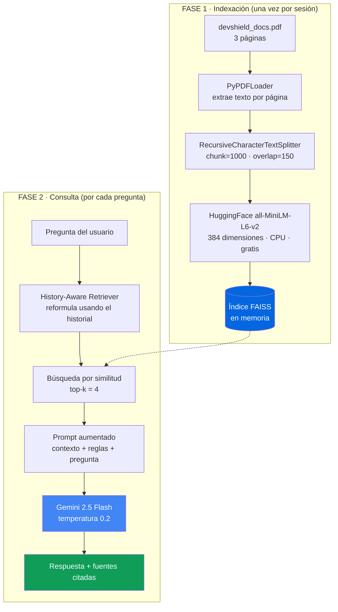

<div align="center">

# DevShield RAG Agent

### Agente Inteligente de documentación basado en Retrieval-Augmented Generation

[](https://www.python.org/)
[](https://streamlit.io/)
[](https://python.langchain.com/)
[](https://ai.google.dev/)
[](https://faiss.ai/)
[](LICENSE)

</div>

---

## Demo en Vivo

> ### **[Probar la aplicación en Streamlit Cloud](https://TU-APP.streamlit.app)**
>
> *(Sustituye este enlace por la URL real una vez completado el despliegue.)*
>
> **Nota:** la app usa la capa gratuita de Gemini. Si la demo pública agota su
> cuota diaria, puedes pegar tu propia API Key en el panel lateral —
> se obtiene gratis en [Google AI Studio](https://aistudio.google.com/app/apikey).

<div align="center">


</div>

---

## Descripción

**DevShield RAG Agent** es un asistente conversacional que responde preguntas
sobre la base de conocimiento técnica, comercial y legal de **DevShield SaaS**
—una plataforma ficticia de detección de vulnerabilidades web (Inyección SQL,
XSS y escaneo de repositorios)—.

El problema que resuelve es concreto: un LLM genérico **no conoce** los precios,
los límites de escaneos ni las cláusulas legales de una empresa privada, y si se
le pregunta, los inventa. Este proyecto aplica **RAG (Retrieval-Augmented
Generation)** para anclar cada respuesta a un documento oficial, de modo que el
modelo cite datos reales en lugar de alucinarlos, y admita explícitamente cuando
una información no está en la documentación.

### Características

| | |
|---|---|
| **Chat conversacional** | Historial con memoria: entiende preguntas de seguimiento como *"¿y en el plan Pro?"* |
| **Trazabilidad** | Cada respuesta muestra los fragmentos exactos del PDF que la fundamentan, con número de página |
| **Anti-alucinación** | Si el dato no está en el documento, el agente lo dice en lugar de inventarlo |
| **Coste cero** | Embeddings locales + capa gratuita de Gemini: sin base de datos ni facturación |
| **API Key flexible** | Se lee de `secrets`, de `.env` o se introduce en caliente desde la interfaz |
| **Arranque rápido** | Índice vectorial en memoria cacheado con `st.cache_resource` |

---

## Arquitectura técnica

El sistema se divide en dos fases: una de **indexación** (se ejecuta una sola vez
al arrancar) y otra de **consulta** (se ejecuta en cada pregunta).



### ¿Por qué estas decisiones?

| Decisión | Alternativa descartada | Motivo |
|---|---|---|
| **Embeddings locales** (`all-MiniLM-L6-v2`) | Embeddings de OpenAI/Gemini vía API | Vectorizar el documento gastaría cuota en cada arranque. El modelo local pesa 90 MB, corre en CPU y es gratuito e ilimitado. |
| **FAISS en memoria** | Pinecone, Chroma persistente, pgvector | Con 3 páginas, el índice cabe en RAM y se reconstruye en segundos. Cero infraestructura externa que mantener o pagar. |
| **Gemini 2.5 Flash** | GPT-4, Claude, Llama local | Capa gratuita generosa, latencia muy baja y ventana de contexto amplia: ideal para un asistente de documentación. |
| **`create_retrieval_chain` (LCEL)** | `RetrievalQA` clásico | La API moderna de LangChain, no deprecada, y devuelve los documentos fuente para la trazabilidad. |
| **History-aware retriever** | Retriever simple | Sin él, un seguimiento como *"¿y cuántos en Pro?"* no recupera nada útil porque le falta el sujeto. |
| **Streamlit Community Cloud** | Docker + VPS | Despliegue directo desde GitHub, HTTPS incluido y gratuito. Sin servidores que administrar. |

### Estructura del repositorio

```
devshield-rag-agent/
│
├── app.py                      # Interfaz Streamlit (chat, sidebar, estado)
├── requirements.txt            # Dependencias con versiones fijadas
├── README.md                   # Este archivo
├── .env.example                # Plantilla de variables de entorno
├── .gitignore                  # Exclusiones de Git (protege .env)
│
├── src/                        # Lógica de negocio (sin dependencias de UI)
│   ├── __init__.py
│   ├── loader.py               #   PDF -> chunks -> embeddings -> índice FAISS
│   └── agent.py                #   Cadena conversacional de QA sobre Gemini
│
├── data/
│   ├── devshield_docs.pdf      # Base de conocimiento (3 páginas)
│   └── devshield_docs.md       #   Fuente en Markdown del documento
│
├── scripts/
│   └── generar_pdf.py          # Regenera el PDF desde el Markdown
│
└── .streamlit/
    ├── config.toml             # Tema visual
    └── secrets.toml.example    # Plantilla de secretos para el despliegue
```

> **Nota de diseño:** `src/` no importa Streamlit en ningún punto. La lógica RAG
> es reutilizable desde un script, una API FastAPI o un test unitario; `app.py`
> es la única capa que conoce la interfaz.

---

## Ejemplos reales de preguntas y respuestas

Estas son respuestas obtenidas del agente sobre el documento de DevShield:

| # | Pregunta del usuario | Respuesta esperada del agente | Fuente |
|:--:|---|---|:--:|
| 1 | **¿Cuántos escaneos y repositorios incluye cada plan?** | El plan **Free** incluye 5 escaneos web al mes y 1 repositorio conectado. El plan **Pro** (US$ 49/mes) sube a 100 escaneos y 10 repositorios. El plan **Enterprise** (US$ 299/mes) ofrece escaneos y repositorios ilimitados. Los escaneos no utilizados no se acumulan para el mes siguiente. | Pág. 2 |
| 2 | **¿Puedo escanear el sitio web de un competidor para ver si es vulnerable?** | No. Los términos de uso prohíben **estrictamente** escanear activos de terceros sin autorización expresa y por escrito: solo puedes analizar dominios y repositorios propios o con consentimiento del titular. Además, la plataforma exige verificar la propiedad mediante registro DNS TXT o un archivo en el servidor antes de cualquier escaneo web. El primer intento no autorizado suspende la cuenta 30 días, y la reincidencia implica cierre definitivo sin reembolso. | Pág. 3 |
| 3 | **Si el servicio se cae, ¿qué compensación recibo?** | Depende de la disponibilidad mensual alcanzada frente a la garantizada (99,5 % en Free y Pro; 99,9 % en Enterprise). Si cae entre 99,0 % y el objetivo, recibes un **10 %** de crédito sobre la factura; entre 95,0 % y 98,99 %, un **25 %**; y por debajo de 95,0 %, un **50 %**. Los créditos aplican solo a planes de pago y deben solicitarse dentro de los 30 días posteriores al incidente escribiendo a `sla@devshield.io`. | Pág. 2 |
| 4 | **¿DevShield se queda con una copia de mi código fuente?** | No. El código sigue siendo propiedad exclusiva del cliente. El código clonado vive únicamente dentro de un contenedor Docker aislado y se elimina de forma irreversible al terminar el análisis (máximo 60 minutos después). Solo se conservan los reportes de hallazgos, cifrados en reposo con AES-256; nunca copias permanentes del código. | Pág. 1 y 3 |

> **Prueba de anti-alucinación:** pregunta *"¿Cuánto cuesta el plan Ultra?"*.
> El agente responderá que no encuentra esa información en la documentación
> oficial, en lugar de inventar un precio.

---

## Instalación y ejecución local (menos de 2 minutos)

### Requisitos previos
- Python **3.10 o superior**
- Una API Key gratuita de [Google AI Studio](https://aistudio.google.com/app/apikey)

### Paso 1 · Clonar el repositorio

```bash
git clone https://github.com/tu-usuario/devshield-rag-agent.git
```

```bash
cd devshield-rag-agent
```

### Paso 2 · Crear y activar el entorno virtual

**Windows (PowerShell):**
```bash
python -m venv venv; .\venv\Scripts\Activate.ps1
```

**Linux / macOS:**
```bash
python3 -m venv venv && source venv/bin/activate
```

### Paso 3 · Instalar las dependencias

```bash
pip install -r requirements.txt
```

> Esta es la parte más lenta (~2–4 min la primera vez): `sentence-transformers`
> arrastra PyTorch. Las siguientes instalaciones usan la caché de pip.

### Paso 4 · Configurar la API Key

```bash
cp .env.example .env
```

Abre `.env` y pega tu clave en `GOOGLE_API_KEY`.
*(También puedes saltarte este paso e introducir la clave directamente en el
panel lateral de la aplicación.)*

### Paso 5 · Ejecutar

```bash
streamlit run app.py
```

La aplicación se abrirá en `http://localhost:8501`. El primer arranque tarda
unos segundos extra porque descarga el modelo de embeddings (~90 MB); a partir
de ahí queda en caché local.

---

## Despliegue en Streamlit Community Cloud

1. **Sube el proyecto a GitHub** como repositorio **público**
   (verifica que `data/devshield_docs.pdf` esté versionado y que `.env` **no** lo esté).
2. Entra en [share.streamlit.io](https://share.streamlit.io) e inicia sesión con GitHub.
3. Pulsa **New app** y selecciona tu repositorio, la rama `main` y el archivo `app.py`.
4. Antes de desplegar, abre **Advanced settings -> Secrets** y pega:
   ```toml
   GOOGLE_API_KEY = "tu-clave-real-aqui"
   ```
5. Pulsa **Deploy**. El primer build tarda entre 3 y 5 minutos (instalación de PyTorch).
6. Copia la URL resultante y pégala en la sección **Demo en Vivo** de este README.

---

## Estrategia de commits sugerida

Historial de 8 commits que evidencia un desarrollo incremental y ordenado
(convención [Conventional Commits](https://www.conventionalcommits.org/)):

| # | Comando | Qué demuestra |
|:--:|---|---|
| 1 | `git commit -m "chore: inicializa el proyecto con estructura base y .gitignore"` | Higiene inicial: secretos protegidos desde el primer commit |
| 2 | `git commit -m "docs: añade la base de conocimiento de DevShield en PDF"` | Los datos entran antes que el código que los consume |
| 3 | `git commit -m "build: define dependencias fijadas en requirements.txt"` | Entorno reproducible |
| 4 | `git commit -m "feat(loader): implementa carga de PDF, chunking e índice FAISS"` | Primera pieza funcional: la capa de recuperación |
| 5 | `git commit -m "feat(agent): añade cadena conversacional de QA con Gemini"` | Capa de generación, aislada de la de recuperación |
| 6 | `git commit -m "feat(app): construye la interfaz de chat en Streamlit"` | Integración de ambas capas en la UI |
| 7 | `git commit -m "feat(app): añade citación de fuentes y gestión de API Key"` | Refinamiento: trazabilidad y experiencia de usuario |
| 8 | `git commit -m "docs: redacta README con arquitectura y guía de despliegue"` | Cierre y documentación del proyecto |

**Flujo recomendado para cada commit:**

```bash
git add . && git commit -m "tipo(alcance): descripción" && git push
```

---

## Resolución de problemas

| Síntoma | Causa y solución |
|---|---|
| `RuntimeError: Tried to instantiate class '__path__._path'` | Conflicto conocido entre el *file watcher* de Streamlit y PyTorch. Ejecuta con `streamlit run app.py --server.fileWatcherType none`. |
| `429 Resource has been exhausted` | Se agotó la cuota gratuita de Gemini. Espera al reinicio diario o usa otra API Key. |
| `ErrorDeCarga: no contiene texto extraíble` | El PDF es una imagen escaneada. Regenéralo con `python scripts/generar_pdf.py`. |
| La app tarda mucho en el primer arranque | Normal: descarga el modelo de embeddings (~90 MB). Solo ocurre una vez. |
| Respuestas imprecisas o incompletas | Sube `k` en `src/agent.py` (`FRAGMENTOS_RECUPERADOS`) o reduce `TAMANO_FRAGMENTO` en `src/loader.py`. |

---

## Licencia y aviso

Distribuido bajo licencia **MIT**.

> **DevShield SaaS es una empresa ficticia.** Todo el contenido del documento
> base (precios, SLAs, cláusulas legales) fue creado con fines exclusivamente
> educativos para demostrar una arquitectura RAG. No representa a ninguna
> compañía real ni constituye asesoramiento legal.

---

<div align="center">

**¿Te resultó útil?** Deja una estrella en el repositorio.

Construido con Python, LangChain y Google Gemini.

</div>
