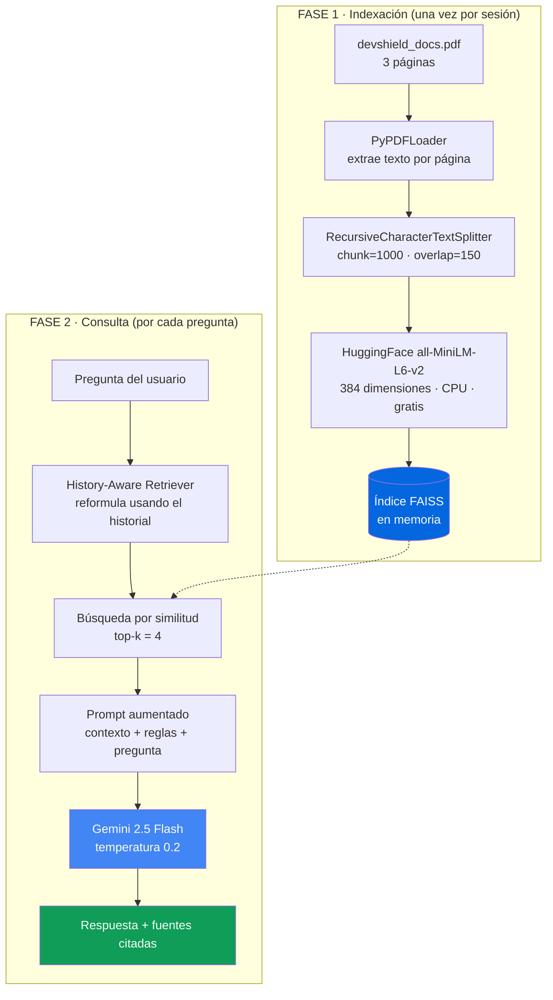

# DevShield RAG Agent

### Agente Inteligente de documentación basado en Retrieval-Augmented Generation

---

## Descripción

**DevShield RAG Agent** es un asistente conversacional que responde preguntas
sobre la base de conocimiento técnica, comercial y legal de **DevShield SaaS**
—una plataforma ficticia de detección de vulnerabilidades web (Inyección SQL,
XSS y escaneo de repositorios)—.

El problema que resuelve es concreto: un LLM genérico **no conoce** los precios,
los límites de escaneos ni las cláusulas legales de una empresa privada, y si se
le pregunta, los inventa. Este proyecto aplica **RAG (Retrieval-Augmented
Generation)** para anclar cada respuesta a un documento oficial, de modo que el
modelo cite datos reales en lugar de alucinarlos, y admita explícitamente cuando
una información no está en la documentación.

> DevShield SaaS es una empresa ficticia; todo el contenido del documento base
> (precios, SLAs, cláusulas legales) fue creado con fines exclusivamente
> educativos y no representa a ninguna compañía real.

### Características

| | |
|---|---|
| **Chat conversacional** | Historial con memoria: entiende preguntas de seguimiento como *"¿y en el plan Pro?"* |
| **Trazabilidad** | Cada respuesta muestra los fragmentos exactos del PDF que la fundamentan, con número de página |
| **Anti-alucinación** | Si el dato no está en el documento, el agente lo dice en lugar de inventarlo |
| **Coste cero** | Embeddings locales + capa gratuita de Gemini: sin base de datos ni facturación |
| **API Key flexible** | Se lee de `secrets`, de `.env` o se introduce en caliente desde la interfaz |
| **Arranque rápido** | Índice vectorial en memoria cacheado con `st.cache_resource` |

---

## Arquitectura técnica

El sistema se divide en dos fases: una de **indexación** (se ejecuta una sola vez
al arrancar) y otra de **consulta** (se ejecuta en cada pregunta).

